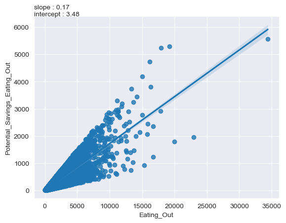
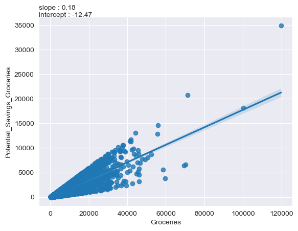
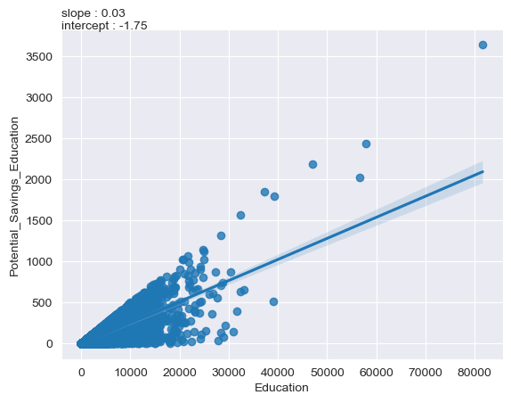
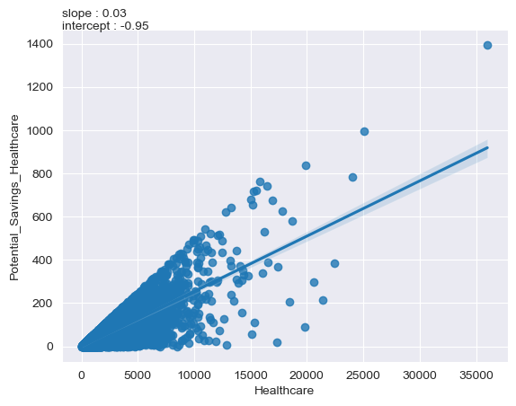
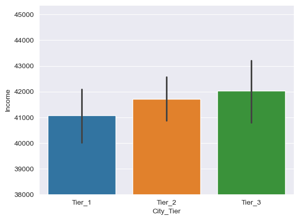
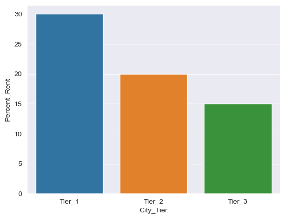
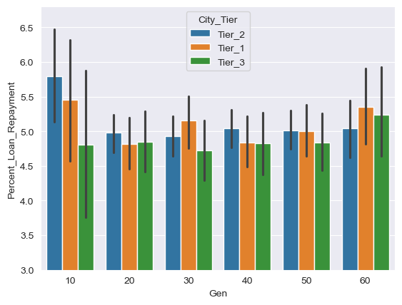

# 🙈 K3J1 EDA 보고서 제출 🙉

흥미있는 Dataset을 선정하고, EDA 탐색적 데이터 분석을 해봅시다.

- 모델 학습에 필요한 **모든 데이터 전처리를 포함**합니다.
- 독립변수간의 여러 **유의미한 관계를 시각화**해주세요.
- EDA를 통해 얻어진 **인사이트를 작성**해주세요.

<제출파일은 다음과 같습니다.>

- dataset파일
- jupyter notebook 실행파일
- EDA 보고서 README.md 파일
- 다음주 월요일 오전에 간단히 발표하고, 최고의 EDA를 선정하도록 하겠습니다 😄

---

## <데이터 보고서>

### 1. 서론

#### 목적: EDA의 목적과 데이터 분석의 배경 설명.

#### 데이터셋 설명

- 출처 : kaggle의 데이터
- 변수
  
  [Personal Data]
  - Income: 월 소득
  - Age: 나이
  - Dependents: (부양가족)
  - Occupation: 직업 유형 또는 고용 형태
  - City_Tier: 거주 지역
      city_tier1 =  대도시
      city_tier2 = 신도시
      city_tier3 = 교외
   [Spendings] 
  - Rent : 집세, 방세, 임차료
  - Loan_Repayment : 대출상환
  - Insurance : 보험
  - Groceries : 식료품
  - Transport : 교통
  - Eating_Out : 외식
  - Entertainment : 오락
  - Utilities :공과금
  - Healthcare : 건강관리
  - Education : 교육
  - Miscellaneous : 그 외

  [Financial Goals & Savings]
  - Desired_Savings_Percentage : 희망 저축 비율
  - Desired_Savings : 희망 저축 금액
  - Disposable_Income : 가처분 소득 (Income - all spendings)

  [Potential Savings]
  - Potential_Savings_Groceries : 식료품 지출에 대한 잠재적 절감액
  - Potential_Savings_Transport : 교통비에 대한 잠재적 절감액
  - Potential_Savings_Eating_Out : 외식비에 대한 잠재적 절감액
  - Potential_Savings_Entertainment : 오락 지출에 대한 잠재적 절감액
  - Potential_Savings_Utilities : 공과금에 대한 잠재적 절감액
  - Potential_Savings_Healthcare : 건강관리 지출에 대한 잠재적 절감액
  - Potential _Savings_Education : 교육비에 대한 잠재적 절감액
  - Potential_Savings_Miscellaneous. 그 외 지출에 대한 잠재적 절감액

### 2. 데이터 정제

#### 결측치 분석

- 결측치 없음.(*결측치: 데이터셋에서 특정 값이 누락된 상태를 의미)
  결측치의 수와 위치, 처리 방법 (제거, 대체 등).
- 이상치 탐지: 이상치의 정의 및 발견된 이상치에 대한 설명.

### 3. 기초 통계량

#### 기술 통계

- 변수별 평균, 중앙값, 분산, 표준편차 등.
- 분포 시각화: 히스토그램, 박스플롯 등을 사용하여 변수의 분포를 시각적으로 표현.

### 4. 변수 간 관계

#### 상관 분석

- 변수 간 상관계수 계산 및 시각화 (히트맵 등).
- 산점도: 주요 변수 간의 관계를 나타내는 산점도 시각화.

### 5. 시각화

- 그래프 및 차트: 데이터의 인사이트를 명확히 전달하기 위한 다양한 그래프(막대그래프, 파이차트, 선그래프 등).
- 해석: 각 시각화에 대한 설명과 해석.

### 6. 인사이트 및 결론

#### 주요 발견

- 예시) 수입이 많을수록 지출도 함께 증가함. (수입 ↑ = 지출 ↑)

#### 후속 조치

- 다음 단계(예: 추가 분석, 모델링)와 관련된 제안.

---

### 👨‍👩‍👧‍👦 팀원소개

3명의 김씨와 1명의 조씨로 구성된 K3J1
김정아, 김진수, 김희애, 조은비

'''

정아

'''

'''

희애

'''

"""

진수

### 각 소비 항목에 대한 실제 지출량 및 Potential Savings 비교

  다음은 각 소비 항목에 대한 실제 지출 및 potential savings에 대한 비교입니다. 각 항목에 대한 분포 이해 및 비교를 위하여 scatter plot을 사용하였으며 
추가적으로는 분포에 대한 linear regression을 그래프에 같이 나타내어 전체적인 추세를 볼수있도록 하였습니다. 좌측 상단에는 linear regression에 대한 slope 및 intercept를 나타내었고
slope는 각 항목이 증가함에 따른 potential savings를 나타내는 비율로 slope가 클수록 비용 절감의 가능성이 높다는 것을 의미합니다.

  여러 Potential savings data 대부분은 아래 나타낸 Eating_out, Groceries 와 같이 실제 소비가 증가함에 따라서 약 17~18 %의 비율로 savings가 늘어남을 보이고 있습니다.
하지만 Education과 Healthcare 항목은 상대적으로 낮은 slope(약 3 %)를 보였습니다. 이는 인도 사회에서 교육 및 건강에 대한 지출이 늘어나더라도 잠재적으로 지출을 줄일 수 있는 부분이 적다는 것을 의미하며 
또한, 교육열 및 건강에 대한 관심이 높다는 것을 의미합니다. 

 
 

이러한 경향은 아래의 heatmap에서도 잘 드러나고 있음을 알 수 있습니다. Heatmap plot은 각 변수간의 상관관계를 나타내는 plot으로 1에 가까울수록 두 변수가 비례하는 관계를
보이고 -1에 가까울수록 반비례임을 나타냅니다. Potential savings education의 경우, 약 0.5에 근접한 수치를 보이며 상대적으로 다른 변수에 비하여 낮은 수치를 보이고 있습니다.
이는 education 분야에서 소비를 줄일수 있는 가능성이 낮다고 볼 수 있습니다. 

### 지역에 따른 Income 및 Rent가 Income에서 차지하는 비율

인도는 기반 산업 및 지형학적 특성 등으로 인하여 Tier1,2,3의 카테고리로 나뉘며 Tier1는 가장 발달된 도시를 의미하며 최근 인도 국가 정책으로 인하여 Tier2,3 도시들에 대한 투자 및 
기업체 유치등의 활발한 투자가 이루워지고 있습니다. 따라서 다양한 대기업들이 Tier2,3 지역에 분포해 있으며 아래 그래프와 같이 Tier 2,3의 평균 Income이 상대적으로
높음을 보여주고 있습니다. 하지만 전통적인 대도시로 인하여 Tier1이 Income대비 높은 rent를 보이고 있으며 Tier 3 에서 가장 낮은 비율을 보이고 있습니다.

### 세대에 따른 Loan repayment

10대부터 60대까지 세대에 따른 income 대비 loan repayment에 대하여 아래의 그래프에 나타내었습니다. 
10대에서 가장 높은 loan payment 비율을 보여주고 있으며 이는 학자금 대출에 의한 loan payement라고 생각되며 20대부터 50대까지는 유사한 비율을 보이고 있습니다.
60대에서 다시 상대적으로 높은 비율을 보이고 있습니다.

"""

"""
은비
"""
