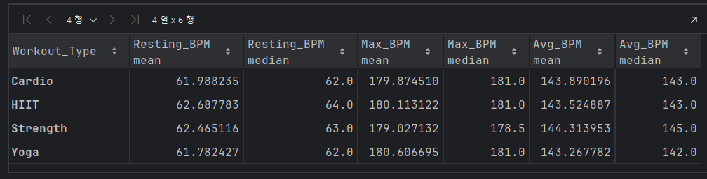

# EDA 보고서

## 주제: 헬스장 회원 분석

1. 분석 목표: 운동 
2. - **분석목표**: 운동 종류에 따른 심박수(`Resting_BPM`, `Max_BPM`, `Avg_BPM`)의 관계와 상관성을 분석하여 운동 유형에 따른 심박수 패턴을 파악하고자 함.

### 1. 데이터 전처리

- 결측치 확인 및 처리
    
    각 변수에 대해 결측치를 확인하였으며, 해당 데이터는 결측치 값이 없는 데이터로 확인됨.
- 
- 이상치 처리
    - 주요 변수(`Max_BPM`, `Avg_BPM`, `Resting_BPM`)에서 박스 플롯을 통해 이상치 확인
    - 주요 변수에서는 이상치가 확인되지 않았음
     
  
- 데이터 타입 변환
    - 범주형 변수 `Gender`, `Workout_Type`, `Experience_Level`을 원-핫 인코딩하여 모델이 학습할 수 있도록 수치형 데이터로 변환했습니다.
    - 예) Gender → Gender_Male(Female:0, Male: 1)
    - 예) Workout_Type → Workout_Cardio, Workout_HIIT, Workout_Strength, Workout_Yoga
    - 심박수와 운동 유형 간의 상관관계는 크지 않아, 운동 종류에 따른 심박수 차이는 뚜렷하지 않은 것으로 보임

### 2. 기초 통계 및 시각화

- 기초 통계 요약
    - 각 수치형 변수들의 평균, 중앙값, 표준편차를 계산하여 테이터의 기본 분포 확인
- 분포 시각화
    - 각 심박수(`Resting_BPM`, `Max_BPM`, `Avg_BPM`)의 히스토그램을 통해 분포를 시각화하여 데이터가 특정 구간에 집중되는지 확인하였습니다.
    - 운동 종류별 심박수 분포를 박스 플롯으로 나타내어 각 운동 종류에 따라 심박수의 분포와 차이를 비교하였습니다.
    
### 3. 운동 종류별 심박수 관계 분석

- 운동 종류별 그룹화 및 평균 비교
    - `Workout_Type`에 따라 `Resting_BPM`, `Max_BPM`, `Avg_BPM`의 평균과 중앙값을 계산하여 운동 유형별 심박수 경향성을 파악하였습니다.
    - 운동 종류별로 심박수의 변화는 미미하였음
- 심박수 변수의 상관관계 분석
    - 각 운동 종류별로 `Resting_BPM`, `Max_BPM`, `Avg_BPM` 간의 상관관계를 계산하여 심박수 지표 간의 관계를 파악하였습니다.
    - 각 운동 종류에 대해 상관관계를 계산하였으며, 이 역시 유의미한 결과를 나타내지 않았음
    

### 4. 상관관계 시각화

- 히트맵
    - 각 운동 종류별 심박수 변수들(`Resting_BPM`, `Max_BPM`, `Avg_BPM`)의 상관계수를 시각화한 히트맵을 통해 시각적으로 상관관계의 강도 표현
    - 히트맵으로 확인한 결과, 심박수와 운동종류 간의 관계는 유의미하지 않음
    
- 박스플롯
    - 운동 종류별 BPM(rest, Max, Avg) 심박수 분포 확인
    - 확인 결과, 운동 종류별로 심박수의 관계는 유의미한 평가 불가
    
    

### 5. 결론

- 운동 종류와 심박수의 관계
    -심박수 예측을 목표로 입력-타겟데이터 분리 후 모델 선형회귀로 분석 진행한 결과, (0.005183986837664263 -0.0198590029937525)라는 무의미한 점수를 반환함
    - 모든 운동 유형에서 `Resting_BPM`, `Max_BPM`, `Avg_BPM` 간의 상관관계가 매우 낮게 나타나거나 거의 없음.
    - 운동 전 휴식 심박수, 최대 심박수, 평균 심박수가 서로 독립적으로 변화하는 경향이 있으며, 운동 유형에 따라 달라지지 않은 것 같음을 시사
- 향후 분석방향
    - 운동 유형과 심박수 간의 관계는 독립적이며, 심박수가 아닌 다른 수치형 변수들 간의 상관관계를 계산하여 운동 유형과 다른 변수들 간의 유의미한 관계를 찾는다
    - 모델 성능 개선 필요하며, 현재 데이터의 특성만으로는 최대 심박수 예측 모델의 성능이 낮게 나타났으며, 모델 개선을 위해 추가적인 피처 엔지니어링과 데이터 정체가 필요
        
    - 추가 분석 방향
        - 다른 회귀모델을 시도하여 모델 성능을 비교하고 최적화
        - Max_bpm에 중요한 영향을 미치는 변수를 선별하여 데이터를 추가분석해 모델의 설명력 높이기

